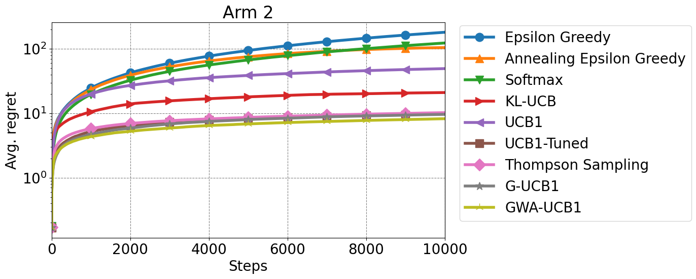

# Multi-armed bandit problems

This project provides a simulation of multi-armed bandit problems.


This implementation is based on the below paper.

Simple Modification of the Upper Confidence Bound Algorithm by Generalized Weighted Averages (https://arxiv.org/).


Note: The arxiv link will be described here as soon as the paper is published on arxiv.

## Requirements

Compatible with Python3.6 and above.
The required libraries are listed below.

- NumPy
- matplotlib

## Installation

```
$ pip install numpy
$ pip install matplotlib
```

## Quickstart StochasticMAB

```
$ python compare_stochastic_mab.py
```

The results are displayed as below.

<p align='center'>
    
</p>

<p align='center'>
    
</p>

For more information, [compare_stochastic_mab.py](compare_stochastic_mab.py).

## Quickstart SurvivalMAB

```
$ python compare_survival_mab.py
```

The results are displayed as below.

<p align='center'>
    
</p>

<p align='center'>
    
</p>

For more information, [compare_survival_mab.py](compare_survival_mab.py).

## Experiments in the paper

The three experiments described in the paper can be executed with the following commands.

```
$ python experiment1.py
```
```
$ python experiment2.py
```
```
$ python experiment3.py
```

## License
This is free and open-source software licensed under the 3-clause BSD license.
